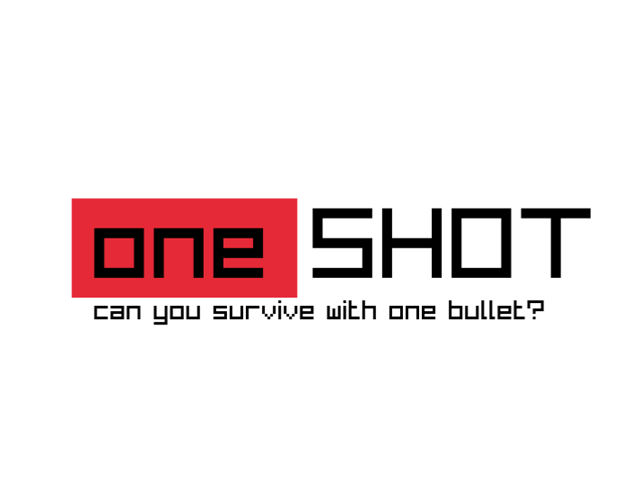
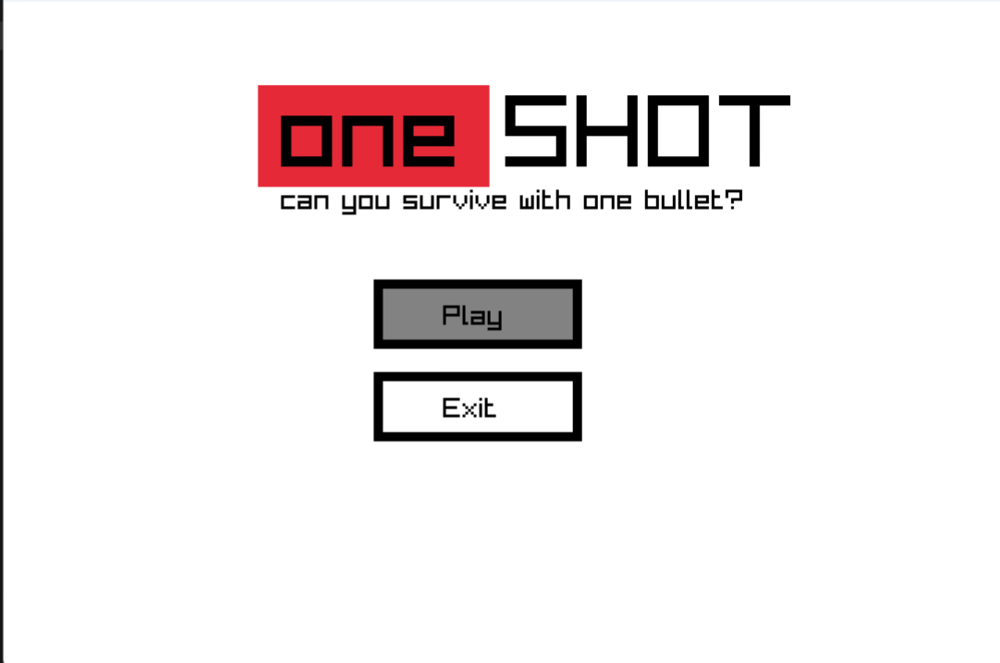
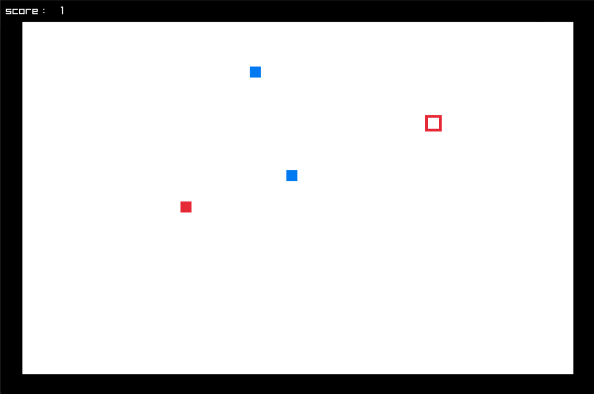
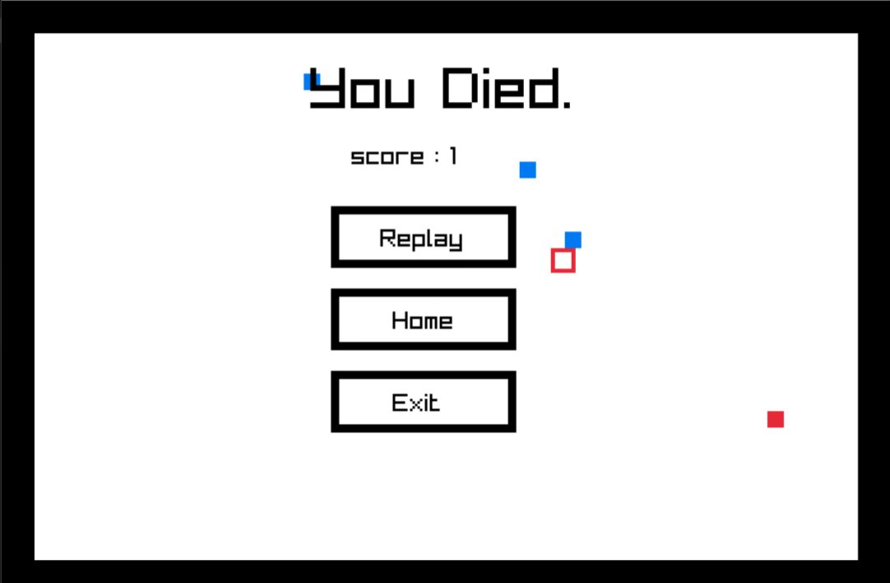

# oneSHOT

You are given just one bullet, can be difficult to survive. But, what if you can reuse the bullet!

Survive the enemies by tactically shooting and recollecting the same bullet as and when you need. 

        

## How to Play

### Option 1: Download from Website

Visit <a href="https://krishna-zawar.itch.io/oneshot" target="_blank">https://krishna-zawar.itch.io/oneshot</a> to download oneSHOT and start playing immediately!

### Option 2: Clone the Repository

1. Clone or download the repository.
2. Install and setup raylib
3. Build the project
4. Enjoy the playing the Game!

## Screenshots

        
        
    

## Contributing

Contributions are welcome! If you'd like to contribute to oneSHOT, please follow these steps:

1. Fork the repository.
2. Create your feature branch (`git checkout -b feature/YourFeature`).
3. Commit your changes (`git commit -am 'Add some feature'`).
4. Push to the branch (`git push origin feature/YourFeature`).
5. Create a new Pull Request.
